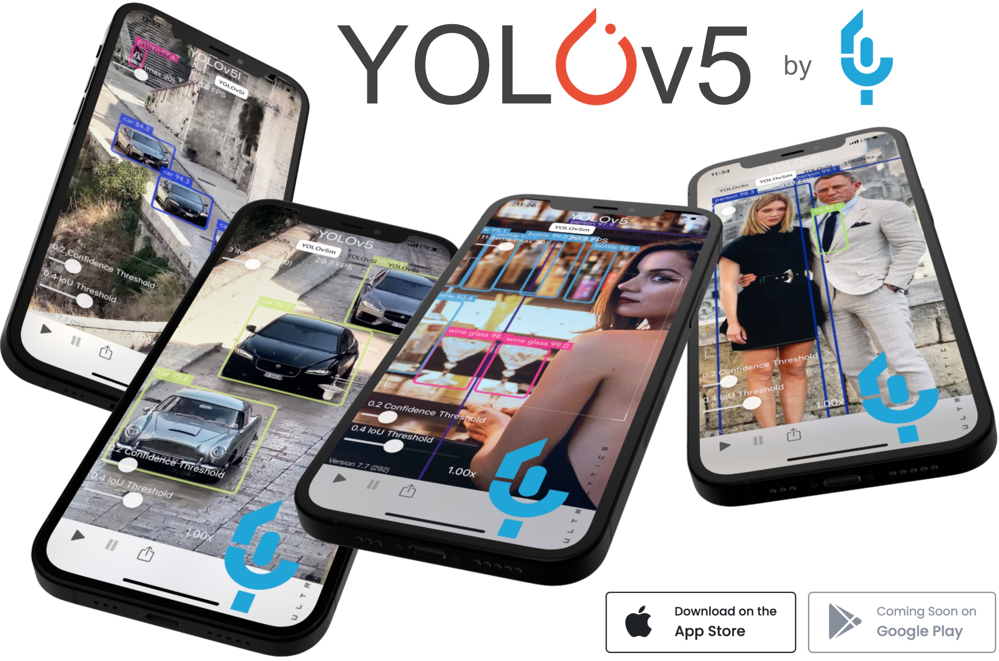

 

   
  

    
    
    
    
    
    
    
    
    
    
    

 

<a href="https://github.com/VuongTuanKhanh/Funix-Capstone-Project"><b>Object Detection project</b></a> 🚀 is the capstone project on object recognition through images and videos, inspired by the <a href="https://www.aicrowd.com/challenges/airborne-object-tracking-challenge">Airborne Object Tracking Challenge</a>
 
This project mainly works with <b>AOT</b> dataset, with a volume of up to 13TB, ambitious towards researching various algorithms such as <a href ="https://pjreddie.com/darknet/yolo/">YOLOv3</a>, <a href ="https://arxiv.org/abs/2004.10934">YOLOv4</a>, <a href ="https://github.com/ultralytics/yolov5">YOLOv5</a>, as well as <a href ="https://github.com/amazon-research/siam-mot">SiamMOT</a>. In addition to studying the paper and applying theory to practice, the project also aims to build custom libraries and deploy the project in practice.

## 
Environments and Integrations

Get started in seconds with our verified environments and integrations,
including [Weights & Biases](https://wandb.ai/site?utm_campaign=repo_yolo_readme) for automatic YOLOv5 experiment
logging. Click each icon below for details.

    
    
    
    
    
    

 

## 
Contribute

We love your input! We want to make contributing to YOLOv5 as easy and transparent as possible. Please see
our [Contributing Guide](CONTRIBUTING.md) to get started.

## 
Contact

For issues running this project please visit [GitHub Issues](https://github.com/VuongTuanKhanh/Funix-Capstone-Project/issues). For business or
professional support requests please visit [https://www.facebook.com/vuongtuankhanh99](https://www.facebook.com/vuongtuankhanh99).

## 
License

By contributing, you agree that your contributions will be licensed under the <a href="https://opensource.org/licenses/MIT">MIT license</a>

 

    
    
    
    
    
    
    
    
    
    
    

