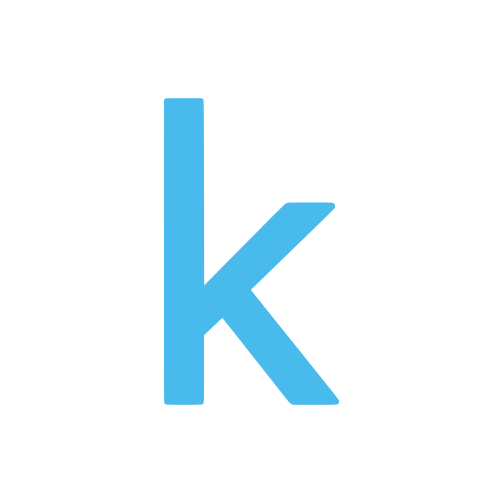

<div align="center">
<p>

</p>
<br>
<div>
<a href="https://github.com/VuongTuanKhanh/Funix-Capstone-Project/blob/main/notebooks/End-to-end%20YOLOv5%20with%20AOT%20Dataset.ipynb"></a>
<a href="./tutorial.ipynb"></a>
<a href="https://hub.docker.com/r/khanhvuongtuan/yolov5_web"></a>
</div>

  <br>
  <div align="center">
    <a href="https://github.com/VuongTuanKhanh">
        
    </a>
    
    <a href="https://www.linkedin.com/in/vuong-tuan-khanh/">
        
    </a>
    
    <a href="https://twitter.com/">
        
    </a>
    
    <a href="https://youtube.com/">
        
    </a>
    
    <a href="https://www.facebook.com/vuongtuankhanh99">
        
    </a>
    
    <a href="https://www.instagram.com/archius_vuong//">
        
    </a>
</div>

<br>
<p>
<a href="https://github.com/VuongTuanKhanh/Funix-Capstone-Project"><b>Object Detection project</b></a> 🚀 is the capstone project on object recognition through images and videos, inspired by the <a href="https://www.aicrowd.com/challenges/airborne-object-tracking-challenge">Airborne Object Tracking Challenge</a>
</p>

## <div align="center">About the Challenge</div>
<div align="left">

One of the important challenges of autonomous flight is the **Sense and Avoid (SAA)** task to maintain enough separation from obstacles. While the route of an autonomous drone might be carefully planned ahead of its mission, and the airspace is relatively sparse, there is still a chance that the drone will encounter unforeseen airborne objects or static obstacles during its autonomous flight.

The autonomous **SAA** module has to take on the tasks of situational awareness, decision making, and flying the aircraft, while performing an evasive maneuver.

There are several alternatives for onboard sensing including radar, **LIDAR**, passive electro-optical sensors, and passive acoustic sensors. Solving the **SAA** task with visual cameras is attractive because cameras have relatively low weight and low cost.

**For the purpose of this project, I consider a  solution that solely relies on a single visual camera and Computer Vision technique that analyzes a monocular video.**

Flying airborne objects pose unique challenges compared to static obstacles. In addition to the typical small size, it is not sufficient to merely detect and localize those objects in the scene, because prediction of the future motion is essential to correctly estimate if the encounter requires a collision avoidance maneuver and create a safer route. Such prediction will typically rely on analysis of the motion over a period of time, and therefore requires association of the detected objects across the video frames.

**As a preliminary stage for determining if a collision avoidance maneuver is necessary**, this challenge will be concerned with spatio - temporal airborne object detection and tracking, given a new **Airborne Object Tracking** dataset, and perform two benchmarks:

<ul align="left">
  <li>Airborne detection and tracking</li>
  <li>Frame-level airborne detection</li>
</ul>
</div>


## <div align="center">Quick Start Examples</div>

<details open align="left">
<summary>Install</summary>

[**Python>=3.6.0**](https://www.python.org/) is required with all
[requirements.txt](https://github.com/VuongTuanKhanh/Funix-Capstone-Project/requirements.txt) installed including
[**PyTorch>=1.7**](https://pytorch.org/get-started/locally/):
<!-- $ sudo apt update && apt install -y libgl1-mesa-glx libsm6 libxext6 libxrender-dev -->

```bash
$ git clone https://github.com/VuongTuanKhanh/Funix-Capstone-Project
$ cd Funix-Capstone-Project
$ pip install -r requirements.txt
```

</details>

<details open align="left">
<summary>Tutorials</summary>

* [About the AOT dataset](https://github.com/VuongTuanKhanh/Funix-Capstone-Project/wiki/About-the-AOT-dataset)&nbsp; 🚀 RECOMMENDED
* [Downloading the Dataset](https://github.com/VuongTuanKhanh/Funix-Capstone-Project/wiki/Downloading-AOT-dataset)&nbsp; ☘️ RECOMMENDED
* [Exploring the Dataset](https://github.com/VuongTuanKhanh/Funix-Capstone-Project/blob/main/notebooks/Dataset_Exploration.ipynb)&nbsp; ⭐ RECOMMENDED
* [Evaluation Benchmarks](https://github.com/VuongTuanKhanh/Funix-Capstone-Project/wiki/Evaluation-Benchmarks)&nbsp;
* [Dataset EDA and Download](https://github.com/VuongTuanKhanh/Funix-Capstone-Project/blob/main/notebooks/Dataset_EDA_and_Download.ipynb)&nbsp; 🚀 RECOMMENDED
* [Baseline with Pre-train YOLOv3](https://github.com/VuongTuanKhanh/Funix-Capstone-Project/blob/main/notebooks/Baseline.ipynb)&nbsp; ☘️ RECOMMENDED
* [Tutorial on how to train YOLOv3 with AOT dataset](https://github.com/VuongTuanKhanh/Funix-Capstone-Project/wiki/Train-YOLOv3-with-the-AOT-Dataset)&nbsp; ⭐ THEORY
* [Airborne Object Detection Benchmark](https://github.com/VuongTuanKhanh/Funix-Capstone-Project/blob/main/notebooks/Airborne_Object_Detection_Benchmark.ipynb)&nbsp; 🚀 MODEL
* [Local Logging Visualization](https://github.com/VuongTuanKhanh/Funix-Capstone-Project/blob/main/notebooks/YOLOv5_Evaluation_with_Local_Logging.ipynb)&nbsp; ☘️ VISUALIZE
* [WanDB Live Visualization](https://wandb.ai/vuongtuankhanh/YOLOv5/reports/YOLOv5-on-Airborne-Object-Tracking-dataset--Vmlldzo5ODkxNjg)&nbsp; 🚀 VISUALIZE
* [End-to-end YOLOv5 with AOT Dataset](https://github.com/VuongTuanKhanh/Funix-Capstone-Project/blob/main/notebooks/End-to-end%20YOLOv5%20with%20AOT%20Dataset.ipynb)&nbsp; 🚀 HIGHLY RECOMMENDED

</details>

<details open align="left">
<summary>Deployments</summary>

* [Docker image with FLASK](https://hub.docker.com/r/khanhvuongtuan/yolov5_web)&nbsp; 🚀 DEPLOYMENT
* [Heroku App](https://aot-flask-demo.herokuapp.com/)&nbsp;

</details>

<details open align="left">
<summary>Basic Actions</summary>

* [Mounting with Google Drive](https://github.com/VuongTuanKhanh/Funix-Capstone-Project/wiki/Uploading-Local-or-Google-Drive-Files-to-Use)&nbsp;
* [Collecting Custom Data](https://github.com/VuongTuanKhanh/Funix-Capstone-Project/wiki/Collecting-Custom-Data)&nbsp;
* [SiamMOT Implementation](https://github.com/VuongTuanKhanh/Funix-Capstone-Project/blob/main/notebooks/siammot.ipynb)&nbsp;
* [Object Detection on Webcam with Scaled YOLOv4](https://github.com/VuongTuanKhanh/Funix-Capstone-Project/blob/main/notebooks/yolov4_webcam.ipynb)&nbsp;
* [Deploy YOLOv5 Web Service with Flask and Docker Image](https://github.com/VuongTuanKhanh/Funix-Capstone-Project/wiki/Deploy-YOLOv5-Web-Service-with-Flask-and-Docker-Image)&nbsp;


</details>

## <div align="center">Environments and Integrations</div>


<div align="center">
    <a href="./tutorial.ipynb">
        
    </a>
    <a href="#">
        
    </a>
    <a href="#">
        
    </a>
    <a href="#">
        
    </a>
    <a href="https://github.com/VuongTuanKhanh/Funix-Capstone-Project">
        
    </a>
    <a href="#">
        
    </a>
</div> 

## <div align="center">Contribute</div>

We love your input! We want to make contributing to this project as easy and transparent as possible. Please see
our [Contributing Guide](CONTRIBUTING.md) to get started.
  
## <div align="center">Special Thank</div>

We would like to give our biggest thanks to **AICrowd** for the great challenge as well as the incredible guidance along the way.
  
**Contact:** [AICrowd](airborne-object-tracking-challenge@amazon.com)

## <div align="center">Contact</div>

For issues running this project please visit [GitHub Issues](https://github.com/VuongTuanKhanh/Funix-Capstone-Project/issues). For business or
professional support requests please visit [https://www.facebook.com/vuongtuankhanh99](https://www.facebook.com/vuongtuankhanh99).

## <div align="center">License</div>

By contributing, you agree that your contributions will be licensed under the <a href="https://opensource.org/licenses/MIT">MIT license</a>

<br>

<div align="center">
    <a href="https://github.com/VuongTuanKhanh">
        
    </a>
    
    <a href="https://www.linkedin.com/in/vuong-tuan-khanh/">
        
    </a>
    
    <a href="https://twitter.com/">
        
    </a>
    
    <a href="https://youtube.com/">
        
    </a>
    
    <a href="https://www.facebook.com/vuongtuankhanh99">
        
    </a>
    
    <a href="https://www.instagram.com/archius_vuong//">
        
    </a>
</div>
